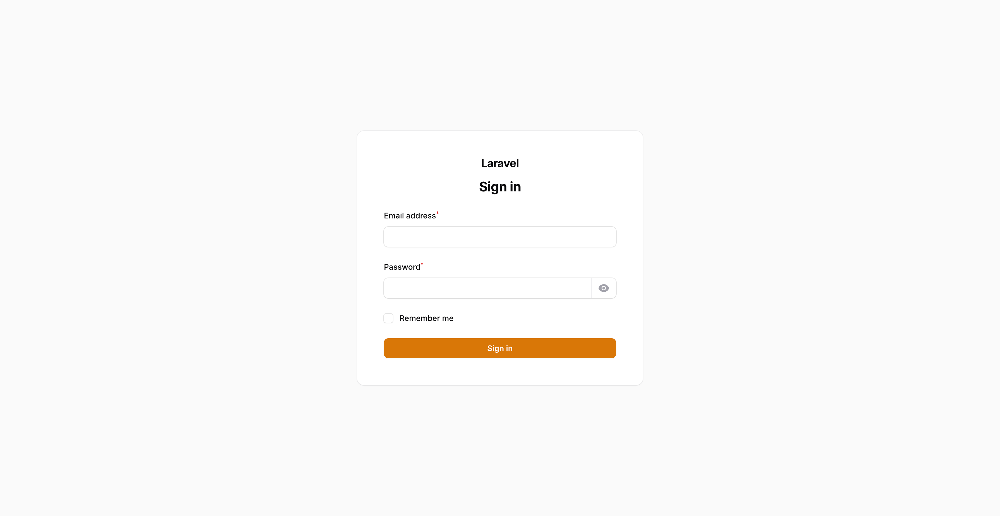
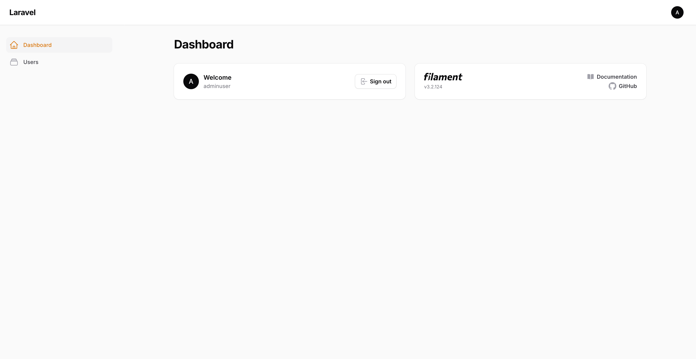
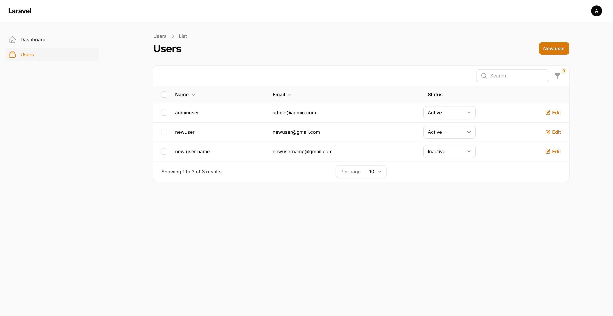
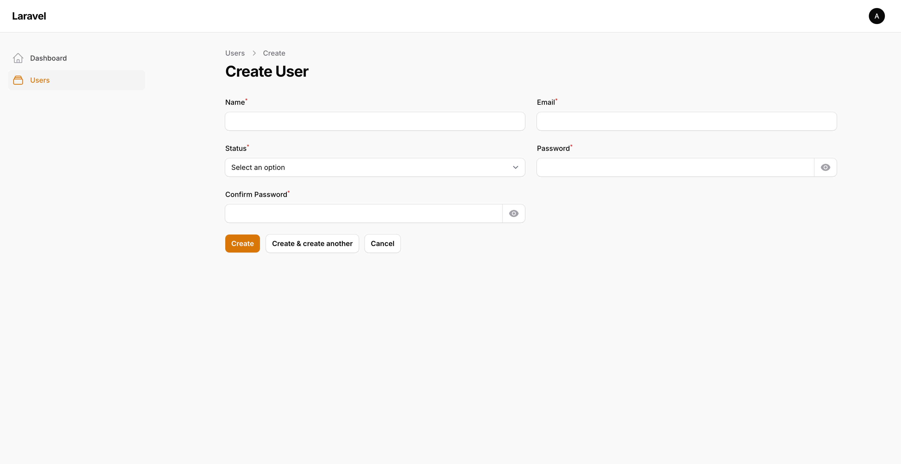
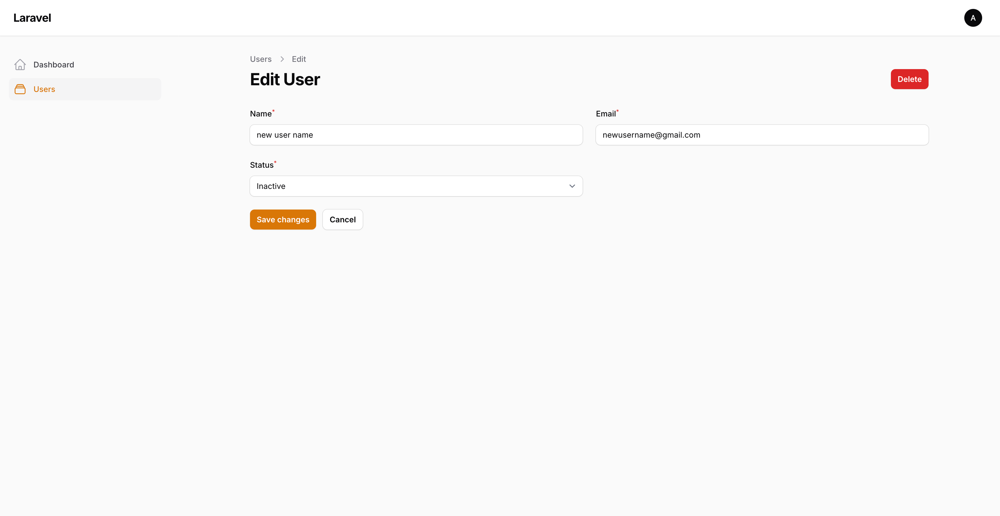
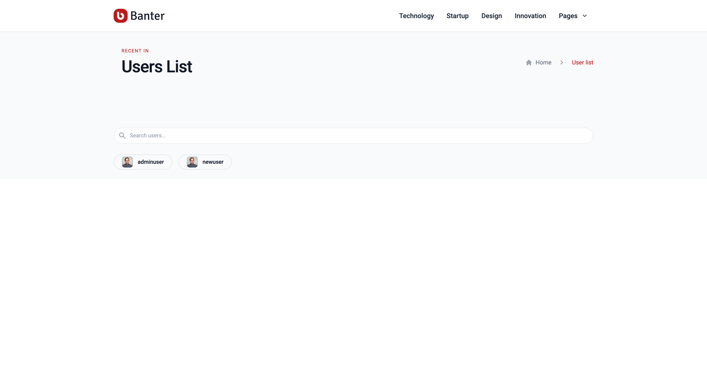

# NodeJS Sample Project

This is a simple Laravel + Filament + Livewire application with admin panel and livewire frontend .

## Installation

Clone the repository-
```
git clone https://github.com/webwizardsusa/laravel-filament-livewire-tailwind.git
```

Then cd into the folder with this command-
```
cd laravel-filament-livewire-tailwind
```

Then do a composer package install
```
sudo composer install
```

Then do a node package install
```
sudo npm install
```

Then create a environment file using this command-
```
cp .env.example .env
```

Then edit `.env` file with appropriate credential for your database server. Just edit these four parameter(`DB_USERNAME`, `DB_PASSWORD`, `DB_NAME`, `DB_HOST`).

Then create a database named `lara_demo` and then do a database migration
```
php artisan migrate
```

## Create a user
You can create a new user account with the following command:
```
php artisan make:filament-user
```

## Run server

Run server using this command-
```
php artisan serve
```

Then go to `http://127.0.0.1:8000/` from your browser and see the app.

## Screenshots
## Login Page
Admin url : http://127.0.0.1:8000/admin/login
Username : admin@admin.com
Password : 123456



## Admin Dashboard Page


## Admin Users List Page


## Admin Add New User Page


## Admin Update User Page


## Frontend User List Page
